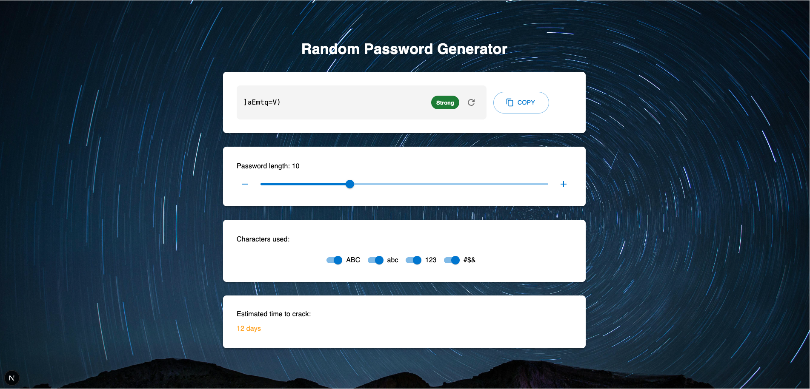

# 🔐 Secure Password Generator App

A modern, responsive, and secure password generator built with **Next.js (frontend)** and **FastAPI (backend)**. It allows users to generate strong passwords based on customizable character rules, visually assess password strength, and see the estimated time it would take to crack the password.

 <!-- Optional: include a real screenshot -->

---

## 🌐 Live Demo

Frontend (Vercel): [https://secure-password-generator-app.vercel.app/](https://secure-password-generator-app.vercel.app/)

---

## 🧩 Features

- 🔁 Real-time password generation with typing animation
- ✅ Toggle character options: uppercase, lowercase, numbers, symbols
- 🔒 Minimum of one selected character type required
- 📏 Adjustable password length (1–30 characters)
- 📈 Password strength meter
- ⏱️ Estimated time to crack password
- 📋 Copy to clipboard with confirmation
- 🎨 Modern UI with Material-UI (MUI)

---

## 🛠️ Tech Stack

### Frontend (Next.js)

- React + Next.js (App Router)
- TypeScript
- Material UI (MUI)
- Axios

### Backend (FastAPI)

- Python 3.11+
- FastAPI
- Uvicorn
- CORS middleware

---

## 📦 Installation

### 🔧 Backend (FastAPI)

```bash
# Clone the repository
git clone https://github.com/MychelGarzon/password-generator-app.git
cd password-generator-app/backend

# Create virtual environment
python -m venv venv
source venv/bin/activate  # On Windows use `venv\Scripts\activate`

# Install dependencies
pip install -r requirements.txt

# Run FastAPI server
uvicorn main:app --reload
```
